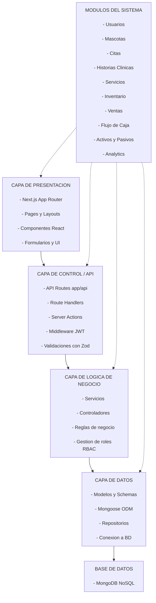

```mermaid
flowchart TB
    A[CAPA DE PRESENTACION<p/>
      - Next.js App Router<p/>
      - Pages y Layouts<p/>
      - Componentes React<p/>
      - Formularios y UI]

    B[CAPA DE CONTROL / API<p/>
      - API Routes app/api<p/>
      - Route Handlers<p/>
      - Server Actions<p/>
      - Middleware JWT<p/>
      - Validaciones con Zod]

    C[CAPA DE LOGICA DE NEGOCIO<p/>
      - Servicios<p/>
      - Controladores<p/>
      - Reglas de negocio<p/>
      - Gestion de roles RBAC<p/>
      ]

    D[CAPA DE DATOS<p/>
      - Modelos y Schemas<p/>
      - Mongoose ODM<p/>
      - Repositorios<p/>
      - Conexion a BD<p/>
      ]

    E[BASE DE DATOS<p/>
      - MongoDB NoSQL<p/>]

    A --> B
    B --> C
    C --> D
    D --> E

    F[MODULOS DEL SISTEMA<p/>
      - Usuarios<p/>
      - Mascotas<p/>
      - Citas<p/>
      - Historias Clinicas<p/>
      - Servicios<p/>
      - Inventario<p/>
      - Ventas<p/>
      - Flujo de Caja<p/>
      - Activos y Pasivos<p/>
      - Analytics<p/>
      ]

    F -.-> A
    F -.-> B
    F -.-> C
    F -.-> D

```
