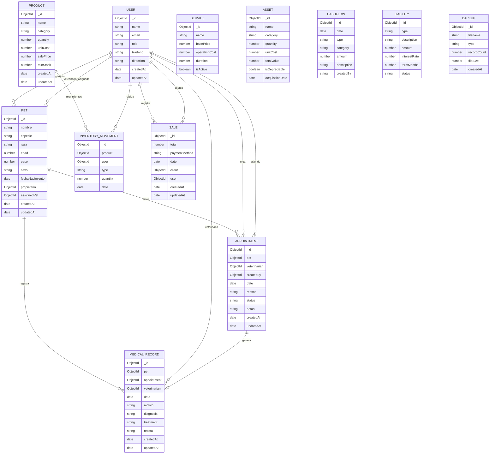

```mermaid
erDiagram

    USER {
        ObjectId _id
        string name
        string email
        string role
        string telefono
        string direccion
        date createdAt
        date updatedAt
    }

    PET {
        ObjectId _id
        string nombre
        string especie
        string raza
        number edad
        number peso
        string sexo
        date fechaNacimiento
        ObjectId propietario
        ObjectId assignedVet
        date createdAt
        date updatedAt
    }

    APPOINTMENT {
        ObjectId _id
        ObjectId pet
        ObjectId veterinarian
        ObjectId createdBy
        date date
        string reason
        string status
        string notas
        date createdAt
        date updatedAt
    }

    MEDICAL_RECORD {
        ObjectId _id
        ObjectId pet
        ObjectId appointment
        ObjectId veterinarian
        date date
        string motivo
        string diagnosis
        string treatment
        string receta
        date createdAt
        date updatedAt
    }

    PRODUCT {
        ObjectId _id
        string name
        string category
        number quantity
        number unitCost
        number salePrice
        number minStock
        date createdAt
        date updatedAt
    }

    INVENTORY_MOVEMENT {
        ObjectId _id
        ObjectId product
        ObjectId user
        string type
        number quantity
        date date
    }

    SERVICE {
        ObjectId _id
        string name
        number basePrice
        number operatingCost
        number duration
        boolean isActive
    }

    SALE {
        ObjectId _id
        number total
        string paymentMethod
        date date
        ObjectId client
        ObjectId user
        date createdAt
        date updatedAt
    }

    ASSET {
        ObjectId _id
        string name
        string category
        number quantity
        number unitCost
        number totalValue
        boolean isDepreciable
        date acquisitionDate
    }

    CASHFLOW {
        ObjectId _id
        date date
        string type
        string category
        number amount
        string description
        string createdBy
    }

    LIABILITY {
        ObjectId _id
        string type
        string description
        number amount
        number interestRate
        number termMonths
        string status
    }

    BACKUP {
        ObjectId _id
        string filename
        string type
        number recordCount
        number fileSize
        date createdAt
    }

    %% RELACIONES
    USER ||--o{ PET : propietario
    USER ||--o{ PET : veterinario_asignado
    PET ||--o{ APPOINTMENT : tiene
    USER ||--o{ APPOINTMENT : crea
    USER ||--o{ APPOINTMENT : atiende
    PET ||--o{ MEDICAL_RECORD : registra
    USER ||--o{ MEDICAL_RECORD : veterinario
    APPOINTMENT ||--o| MEDICAL_RECORD : genera
    PRODUCT ||--o{ INVENTORY_MOVEMENT : movimientos
    USER ||--o{ INVENTORY_MOVEMENT : realiza
    USER ||--o{ SALE : registra
    USER ||--o{ SALE : cliente
```